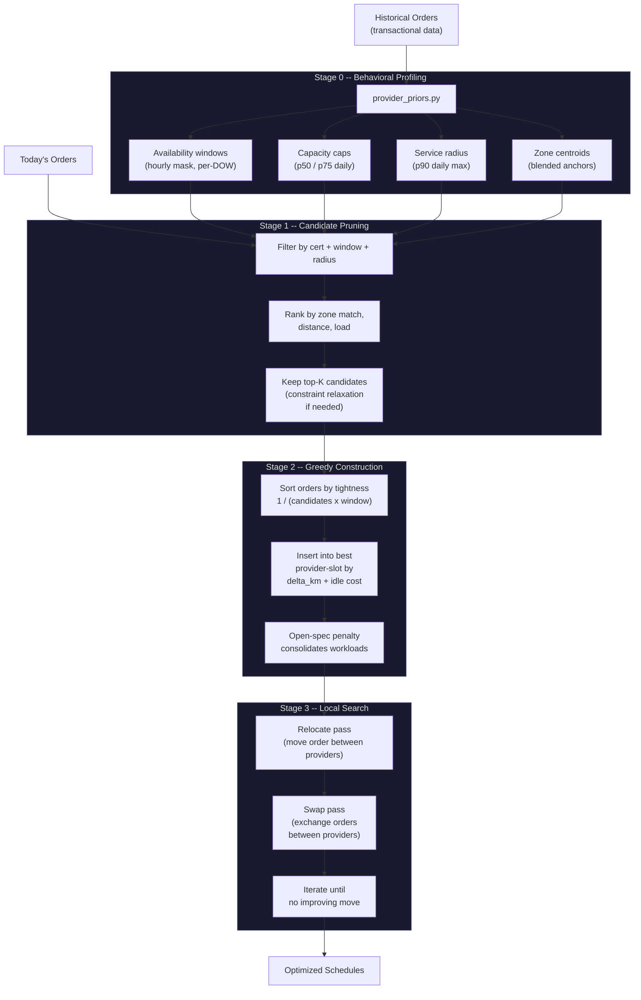

# Service Marketplace Optimizer

A two-stage optimization pipeline for assigning orders to service providers in on-demand marketplaces (beauty, cleaning, home repair), solving a **Vehicle Routing Problem with Time Windows and Skill Matching (VRPTW-SM)**.

1,900+ lines of production-grade Python. Zero external dependencies. Deployed against real operational data.

---

## Problem

On-demand service marketplaces typically let providers self-select which orders to accept. This leads to geographic inefficiency, underutilized providers, and unserved demand. In practice, roughly **10% of orders go unserved** because no provider picks them up -- even when a feasible assignment exists.

The core challenge: build provider schedules that respect certification requirements, time windows, travel constraints, and individual capacity limits -- while minimizing the number of dropped orders and total travel distance.

---

## Pipeline



---

## Objective Function

Local search optimizes the full natural objective directly. All five terms are evaluated on every candidate move via cheap O(n) delta computations:

```
minimize   2,000,000 * unserved
               + 100 * travel_km
                + 10 * idle_min
                 + 5 * providers_used
                 + 2 * zone_mismatch
```

The weight hierarchy is deliberate:

| Term | Weight | Rationale |
|---|---|---|
| Unserved orders | 2M | Lexicographic priority -- exhaust all options before dropping an order |
| Travel distance (km) | 100 | Geographic efficiency; less travel = more time for appointments |
| Idle time (min) | 10 | Compact schedules; prevents 9 AM + 4 PM assignments on the same provider |
| Providers used | 5 | Consolidate workloads; fewer active providers = higher utilization each |
| Zone mismatch | 2 | Soft preference for keeping providers in their historical operating zones |

During greedy construction (Stage 2), the insertion cost for placing an order with a provider is:

```
insertion_cost = delta_km + OPEN_SPEC_PENALTY
```

The `OPEN_SPEC_PENALTY` (25 km-equivalent) discourages opening a new provider when an existing one can absorb the order. This value was tuned via Pareto sweep over `{0, 2, 5, 8, 12, 16, 20, 25, 35}` across 5 validation days, selecting the knee that simultaneously reduced provider count (-2%), travel (-2%), and improved orders-per-provider (+2%) without increasing overflow.

---

## Constraint Relaxation

Candidate pruning applies constraints in order of hardness. When a hard-to-place order has zero candidates, constraints are relaxed from the softest end:

```
 HARD    Certifications ............. provider must hold the required cert
         Time windows ............... order must fall within provider's
                                     availability mask (hourly, per-DOW)

 SOFT    Zone preference ............ ranking signal only; does not filter
         Radius cap ................. relaxable (p90 -> expanded search)
```

Certifications and time windows are never relaxed. Zone preference is used only for ranking (not filtering), so it never blocks a candidate. The radius cap is the only truly relaxable constraint -- and relaxation is logged for post-hoc analysis.

---

## Results

Validated on a real marketplace dataset. Absolute values are redacted (client confidentiality). Relative improvements were validated on real operational data with a temporal train/test split (see Validation Discipline below).

| Metric | Baseline | Optimized | Delta |
|---|---|---|---|
| Unserved demand | 10.6% | 2.2% | **-79%** |
| Travel distance | -- | -- | **-19%** |
| Orders per provider | -- | -- | **+21%** |

The optimizer serves nearly 5x more of the previously-dropped orders while simultaneously reducing travel and increasing provider utilization.

Sensitivity: running the backtest at 12 km/h instead of 10 km/h changes unserved demand by only 0.08 pp (2.20% to 2.12%). The results are robust to the exact speed choice -- travel is not the dominant constraint.

---

## Validation Discipline

Look-ahead bias is the most common failure mode in optimization backtests. If behavioral priors are built from the same data used for evaluation, the optimizer is "cheating" -- it already knows which providers will be active on a given day.

This project enforces a strict temporal split:

```
Days 1 ............... 59         60 ............... 95
|---- training period ----|       |--- test period ---|

  Build behavioral priors            Evaluate optimizer
  (windows, capacity,                (all reported metrics
   radius, zones)                     come from here)
```

All reported results come exclusively from the test period. The optimizer has never seen the test days during prior construction. This is standard practice in ML but rare in operations research backtests.

Additionally: results were stress-tested across multiple speed factor configurations and radius caps. The 79% reduction in unserved demand holds across all tested configurations (range: 79-86%).

---

## Key Design Decisions

**Local search over CP-SAT.** An earlier iteration used Google OR-Tools CP-SAT as Stage 3. Without successor variables or Circuit constraints, CP-SAT couldn't represent travel and idle time in its objective -- its partial objective was misaligned with the natural objective. The strict-improvement check rejected every CP-SAT solution. Local search optimizes the full objective directly via cheap O(n) deltas and converges in seconds.

**Behavioral priors from transactional data.** Provider availability windows, capacity caps, and service radii are inferred from historical order patterns (hourly masks, percentile aggregations) rather than self-reported schedules. This captures actual behavior -- including bimodal work patterns and day-of-week variation -- without requiring providers to maintain accurate calendars.

**Bimodal availability detection.** Many providers work split shifts (e.g., 8-11 AM and 2-5 PM). The prior builder detects dead hours (below 20% activity threshold) and produces multi-block availability windows rather than a single inflated [8 AM, 5 PM] range. This prevents assigning orders into lunch breaks.

**Tightness-first insertion order.** Orders are inserted in decreasing order of `1 / (n_candidates * window_width)`. The most constrained orders get first pick of providers, while flexible orders absorb whatever remains. This is a standard heuristic in VRP construction but the tightness metric is adapted for the skill-matching dimension.

**Zero dependencies.** Pure Python, standard library only. No external solvers, no pip install. The travel model uses haversine distance with calibrated speed factors (10 km/h public transit, 20 km/h car) and a handover slack budget of 15 minutes per transition (max 3 per day).

---

## Mathematical Formulation

The full VRPTW-SM formulation is in [`formulation/`](formulation/), including:

- Sets, parameters, and decision variables (assignment `x`, sequencing `y`, timing `t`, unmet demand `u`)
- Objective function (weighted: unmet demand, travel, delay, idle)
- 11 constraint families (skill compatibility, flow conservation, temporal feasibility, time windows, capacity, max gap)
- Complexity analysis and solution approach by scale

The formulation targets an exact MIP solver for single-zone instances (30-50 orders, 10-20 providers). The heuristic pipeline in this repo is the production approach for full-city scale (250+ orders, 200+ providers).

See [`formulation/formulation.pdf`](formulation/formulation.pdf).

---

## File Structure

```
service-marketplace-optimizer/
|
|-- provider_priors.py ......... Stage 0: behavioral profiling
|                                  - hourly availability masks (per-DOW)
|                                  - capacity caps (p50/p75 daily minutes, p90 order count)
|                                  - service radius (p90 daily max haversine)
|                                  - zone centroids (blended operational anchors)
|                                  - bimodal shift detection
|
|-- allocator.py ............... Stage 1+2: candidate pruning + greedy construction
|                                  - cert/window/radius filtering with relaxation chain
|                                  - tightness-first insertion ordering
|                                  - delta-km + open-spec-penalty insertion cost
|                                  - travel model (haversine, 10/20 km/h, handover slack)
|
|-- local_search.py ........... Stage 3: hill-climbing refinement
|                                  - relocate + swap neighborhood moves
|                                  - full natural objective (5-term weighted sum)
|                                  - O(n) delta evaluation per move
|                                  - strict-improvement acceptance only
|
|-- formulation/ .............. VRPTW-SM mathematical formulation
|   |-- formulation.tex            LaTeX source (11 constraint families)
|   |-- formulation.pdf            Compiled PDF
|
|-- presentation_en.html ...... Full case study (English)
|-- presentation_pt.html ...... Full case study (Portuguese)
```

Each stage is independently runnable and testable. The pipeline composes as:
`provider_priors` --> `allocator` --> `local_search`.

---

## More

See the [full case study presentation](presentation_en.html) for detailed methodology, route visualizations, and provider-level impact analysis.

Part of the [Op-Era](https://github.com/bchalita/op-era) optimization deployment platform.

## License

MIT
